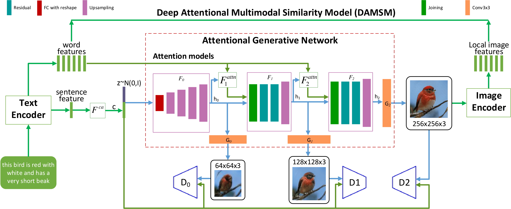

# AttnGAN (To appear soon)

Pytorch implementation for reproducing AttnGAN results in the paper [AttnGAN: Fine-Grained Text to Image Generation
with Attentional Generative Adversarial Networks](https://arxiv.org/pdf/1711.10485.pdf) by Tao Xu, Pengchuan Zhang, Qiuyuan Huang, Han Zhang, Zhe Gan, Xiaolei Huang, Xiaodong He. (This work was performed when Tao was an intern with Microsoft Research). 




### Dependencies
python 2.7

Pytorch

In addition, please add the project folder to PYTHONPATH and `pip install` the following packages:
- `python-dateutil`
- `easydict`
- `pandas`
- `torchfile`


**Data**

1. Download our preprocessed metadata for [birds](https://drive.google.com/open?id=17L19M4ZF6PIgpValds4sWHbQQbIf7eim) [coco](https://drive.google.com/open?id=10t9Inqe3Wle0hmTVzDOavTqRo0vGverk) and save them to `data/`
2. Download the [birds](http://www.vision.caltech.edu/visipedia/CUB-200-2011.html) image data. Extract them to `data/birds/`
3. Download [coco](http://cocodataset.org/#download) dataset and extract the images to `data/coco/`


**Training**
- Pre-train DAMSM models:
  - For bird dataset: `python pretrain_DAMSM.py --cfg cfg/DAMSM/bird.yml --gpu 0`
  - For coco dataset: `python pretrain_DAMSM.py --cfg cfg/DAMSM/coco.yml --gpu 1`
 
- Train AttnGAN models:
  - For bird dataset: `python main.py --cfg cfg/bird_attn2.yml --gpu 2`
  - For coco dataset: `python main.py --cfg cfg/coco_attn2.yml --gpu 3`

- `*.yml` files are example configuration files for training/evaluation our models.


**Pretrained Model**
- [DAMSM for bird](https://drive.google.com/open?id=1GNUKjVeyWYBJ8hEU-yrfYQpDOkxEyP3V). Download and save it to `DAMSMencoders/`
- [DAMSM for coco](https://drive.google.com/open?id=1zIrXCE9F6yfbEJIbNP5-YrEe2pZcPSGJ). Download and save it to `DAMSMencoders/`
- [AttnGAN for bird](https://drive.google.com/open?id=1lqNG75suOuR_8gjoEPYNp8VyT_ufPPig). Download and save it to `models/`
- [AttnGAN for coco](https://drive.google.com/open?id=1i9Xkg9nU74RAvkcqKE-rJYhjvzKAMnCi). Download and save it to `models/`


**Sampling**
- Run `python main.py --cfg cfg/eval_bird.yml --gpu 1` to generate examples from captions in files listed in "./data/birds/example_filenames.txt". Results are saved to `DAMSMencoders/`. 
- Change the `eval_*.yml` files to generate images from other pre-trained models. 
- Input your own sentence in "./data/birds/example_captions.txt" if you wannt to generate images from customized sentences. 


**Examples generated by AttnGAN [[Blog]](https://blogs.microsoft.com/ai/drawing-ai/)**

 bird example              |  coco example
:-------------------------:|:-------------------------:
  |  


### Citing AttnGAN
If you find AttnGAN useful in your research, please consider citing:

```
@article{Han17stackgan2,
  author    = {Tao Xu, Pengchuan Zhang, Qiuyuan Huang, Han Zhang, Zhe Gan, Xiaolei Huang, Xiaodong He},
  title     = {AttnGAN: Fine-Grained Text to Image Generation with Attentional Generative Adversarial Networks},
  Year = {2018},
  booktitle = {{CVPR}}
}
```

**Reference**

- [StackGAN++: Realistic Image Synthesis with Stacked Generative Adversarial Networks](https://arxiv.org/abs/1710.10916) [[code]](https://github.com/hanzhanggit/StackGAN-v2)
